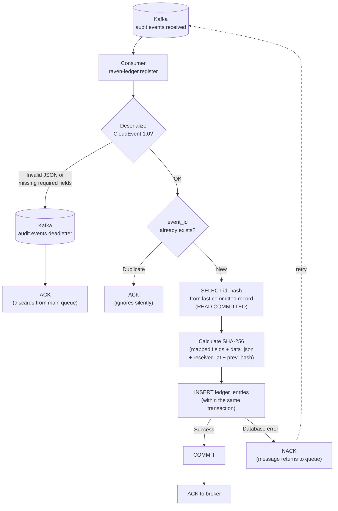
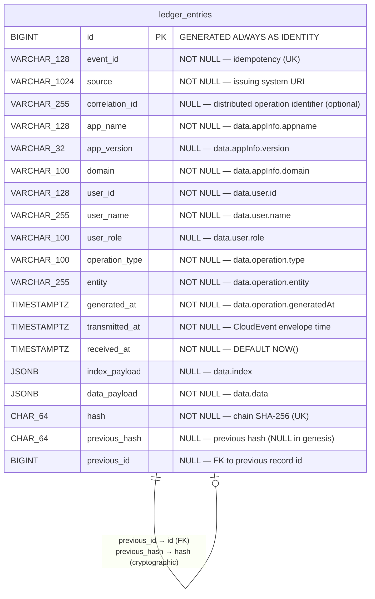
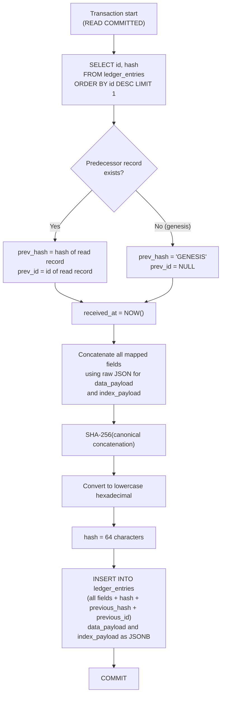

# [FEATURE] FT-03 — AuditEvent Processing and Immutable Persistence (Register Service)

## Description

**Wave 1 — MVP | Lean Inception: Automatic Registration + Immutable Registration**

This feature implements the `raven-ledger.register` service, responsible for consuming events from the message queue and persisting each AuditEvent in `LedgerDatabase` in an immutable fashion. Immutability is RavenLedger's central reliability property: once written, a record cannot be changed or removed — not by the system itself, nor by database administrators (via role permission controls).

Beyond immutability through permissions, each record maintains a **hash chain** that cryptographically links each entry to the previous one, allowing detection of any retroactive tampering even if someone gains direct access to the database.

The separation between ingestion (FT-02) and persistence (this feature) is a deliberate architectural decision: it guarantees the 100ms SLA at the entry point without compromising write reliability.

**Dependencies:**
- **FT-01** — `LedgerDatabase` provisioned and accessible (empty PostgreSQL, no tables).
- **FT-01** — Kafka topic `audit.events.received` created and operational.
- **FT-02** — `raven-ledger.ingestion` service publishing events to the topic.

**Business scenarios:**
- **Happy path:** Event in queue → read by register → payload deserialized → hash calculated → persisted in LedgerDatabase → ACK sent to broker.
- **Duplicate event:** Same `event_id` → record silently ignored (idempotency via UNIQUE constraint).
- **Corrupted payload:** Invalid JSON in the queue → message moved to dead-letter queue with error log.
- **Database unavailable:** Connection failure → NACK, message returns to queue for reprocessing.
- **Partial failure:** Successful persistence but ACK lost → duplicate blocked by UNIQUE constraint on retry.

## Technical Description

**Service:** `raven-ledger.register` (.NET 10, Background Worker — consumer via `Confluent.Kafka`)

**Schema owner:** This service is the *owner* of `LedgerDatabase`. FT-01 provisions the empty database; this feature creates the tables via **FluentMigrator** at service startup. The migration number follows the `YYYYMMDDHHmm` pattern.

---

### Libraries Used

| Library | Role in this service |
|---|---|
| **Confluent.Kafka** | Official Kafka client for consuming the `audit.events.received` topic and publishing to `audit.events.deadletter`; ACK/NACK and retry management |
| **Dapper** + **Npgsql** | PostgreSQL access — SELECT of the previous hash and INSERT into `ledger_entries`; Npgsql as the ADO.NET driver |
| **FluentMigrator** | Creation and versioning of the `LedgerDatabase` schema at service startup |
| **Serilog** + **Serilog.Sinks.OpenTelemetry** | Structured JSON logging; emission via OTLP to Grafana Alloy |
| **OpenTelemetry .NET SDK** | Metrics and traces instrumentation; export via OTLP to Grafana Alloy |

**Test libraries:** Bogus (data generation), NSubstitute (mocks/stubs), AutoBogus.NSubstitute (automatic fakes), Shouldly (assertions), Coverlet.Collector (code coverage).

---

### Configuration and Secrets

The separation between configuration and secrets follows the policy defined in the project's technical constraints:

| Environment | Configuration (non-sensitive) | Secrets |
|---|---|---|
| **Local development** | `appsettings.Development.json` | `dotnet user-secrets` — PostgreSQL connection string and Kafka address/credentials |
| **Production** | Non-sensitive environment variables | **OpenBao** at runtime — connection string, Kafka credentials, and TLS certificates |

`appsettings.Development.json` **must not contain any secrets** — only non-sensitive configuration overrides (e.g.: log level, topic name).

---

### Processing Flow

The diagram below represents the complete message cycle from the Kafka topic to the ACK, including exception paths (dead-letter and NACK for reprocessing).



---

### Entity Model

The `ledger_entries` table has no relationships with other tables — it is a self-contained, append-only structure. The diagram represents the columns, types, and the logical self-reference of the hash chain (not a real FK; the relationship is verified by the application).



---

### CloudEvent → ledger_entries Mapping

The event envelope follows the **CloudEvents 1.0** specification (cf. `docs/systemDesign/event.json`).

| CloudEvent field                   | Column            | Nullability | Notes                                                             |
|------------------------------------|-------------------|-------------|-------------------------------------------------------------------|
| `id`                               | `event_id`        | NOT NULL    | Idempotency key                                                   |
| `source`                           | `source`          | NOT NULL    | Issuing system URI                                                |
| `metadata.correlationId`           | `correlation_id`  | NULL        | Optional; links events from different services in the same transaction |
| `time`                             | `transmitted_at`  | NOT NULL    | Canonical field per the CloudEvents 1.0 spec                     |
| `data.appInfo.appname`             | `app_name`        | NOT NULL    |                                                                   |
| `data.appInfo.version`             | `app_version`     | NULL        |                                                                   |
| `data.appInfo.domain`              | `domain`          | NOT NULL    |                                                                   |
| `data.user.id`                     | `user_id`         | NOT NULL    |                                                                   |
| `data.user.name`                   | `user_name`       | NOT NULL    |                                                                   |
| `data.user.role`                   | `user_role`       | NULL        |                                                                   |
| `data.operation.type`              | `operation_type`  | NOT NULL    | insert / update / delete / any string                             |
| `data.operation.entity`            | `entity`          | NOT NULL    | Name of the affected entity                                       |
| `data.operation.generatedAt`       | `generated_at`    | NOT NULL    | When the operation occurred in the client system                  |
| `data.index`                       | `index_payload`   | NULL        | JSONB with custom indexing fields                                 |
| `data.data`                        | `data_payload`    | NOT NULL    | JSONB with the audited business object                            |
| *(generated by register)*          | `received_at`     | NOT NULL    | `DEFAULT NOW()` on INSERT                                         |
| *(calculated before INSERT)*       | `hash`            | NOT NULL    | See algorithm below                                               |
| *(read from last record)*          | `previous_hash`   | NULL        | NULL only in the genesis record                                   |
| *(read from last record)*          | `previous_id`     | NULL        | `id` of the previous record; NULL only in the genesis record      |

> **`contenttype`** (field present in `event.json`) is a CloudEvents 0.3 extension attribute, not mapped to a dedicated column.
>
> **`data.operation.transmittedAt`** and the envelope field `time` carry the same instant. The mapping uses `time` (envelope), as it is the canonical field per the CloudEvents 1.0 specification.

---

### LedgerDatabase Schema

**Migration:** created via **FluentMigrator** at service startup. The DDL follows the project conventions (`db-conventions`).

#### Constraints

| Constraint | Type | Field(s) |
|---|---|---|
| `pk_ledger_entries` | PRIMARY KEY | `id` |
| `uk_ledger_entries__event_id` | UNIQUE | `event_id` |
| `uk_ledger_entries__hash` | UNIQUE | `hash` |
| `ck_ledger_entries__hash_length` | CHECK | `LENGTH(hash) = 64` |
| `fk_ledger_entries__previous_id` | FOREIGN KEY | `previous_id` → `ledger_entries(id)` |

#### Indexes

The `PRIMARY KEY` and `UNIQUE` constraints already create implicit indexes that cover all of the service's own operations:

| Implicit index | Field | Operation covered |
|---|---|---|
| `pk_ledger_entries` | `id` | `SELECT ORDER BY id DESC LIMIT 1` to read the previous hash and id |
| `uk_ledger_entries__event_id` | `event_id` | Idempotency check before INSERT |
| `uk_ledger_entries__hash` | `hash` | Chain uniqueness guarantee |

| Explicit index | Field | Type | Rationale |
|---|---|---|---|
| `idx_ledger_entries__previous_id` | `previous_id` | B-tree | Support for chain verification JOIN (`ON id = previous_id`) |
| `idx_ledger_entries__correlation_id` | `correlation_id` | Partial B-tree (`WHERE correlation_id IS NOT NULL`) | Traceability by distributed operation (`?correlation_id=`) |

Additional indexes to support queries from the visualization interface will be defined in the corresponding feature, once the access patterns are specified.

---

### Hash Algorithm

The hash for each entry is calculated **before the INSERT**, in the application layer (C#), with SHA-256 over the canonical concatenation of all mapped fields.

#### Why raw JSON for `data_payload` and `index_payload`?

PostgreSQL normalizes JSONB when storing (sorts keys, removes spaces). If the hash were calculated over `data_payload::text` read back from the database, the result would differ from the original hash — making chain verification impossible without re-executing the INSERT. The solution is to use the raw JSON extracted from the CloudEvent **before** conversion to `JsonDocument`, guaranteeing byte-fidelity for the hash while the database stores JSONB for queries.

#### Canonical format

```
hash = SHA-256(
    event_id
    + "|" + spec_version
    + "|" + source
    + "|" + (correlation_id ?? "")
    + "|" + event_type
    + "|" + app_name
    + "|" + (app_version ?? "")
    + "|" + domain
    + "|" + user_id
    + "|" + user_name
    + "|" + (user_role ?? "")
    + "|" + operation_type
    + "|" + entity
    + "|" + generated_at.ToString("yyyy-MM-ddTHH:mm:ss.fffffffZ")
    + "|" + transmitted_at.ToString("yyyy-MM-ddTHH:mm:ss.fffffffZ")
    + "|" + (index_payload_raw_json ?? "")
    + "|" + data_payload_raw_json
    + "|" + received_at.ToString("yyyy-MM-ddTHH:mm:ss.fffffffZ")
    + "|" + (previous_hash ?? "GENESIS")
)
```

The result is converted to lowercase hexadecimal (64 characters) before being stored.

- `index_payload_raw_json` — JSON string extracted from `data.index` of the original CloudEvent, **before** any C# parsing. Empty (`""`) when the field is absent.
- `data_payload_raw_json` — JSON string extracted from `data.data` of the original CloudEvent, **before** any C# parsing.
- `NULL` values in scalar fields (`app_version`, `user_role`) are represented as an empty string `""` in the concatenation.

#### Flow within the transaction



---

### Hash Chain

Each record points to the hash of the previous record, forming an immutable chain. Any tampering with a record invalidates all subsequent hashes, making fraud immediately detectable through a sequential scan.


Under concurrency, the chain may fork: two records inserted simultaneously may read the same confirmed predecessor and both reference its `id` and `hash`. The result is a **tree rooted at genesis**, not necessarily a linear list. This is expected and does not indicate tampering — forks are detectable from the graph structure itself (two records with the same `previous_id`).

The chain has two complementary integrity mechanisms:

| Mechanism | Field | Purpose |
|---|---|---|
| **Structural** | `previous_id` (FK) | Relational navigation — allows traversing the tree via JOIN and detects records without a valid predecessor |
| **Cryptographic** | `previous_hash` (SHA-256) | Detects retroactive tampering — any change to a record's fields invalidates all hashes in the descendant branch(es) |

**Chain verification:** traverses all paths from genesis to leaves (records without descendants). On each path, recalculates the hash of each record — extracting scalar fields and the JSON from `data_payload::text` / `index_payload::text` — and validates that the `previous_hash` of the current record matches the `hash` of the record pointed to by `previous_id`. If any record was tampered with, removed, or inserted with an invalid reference, at least one of the mechanisms will break on that branch.

> **Note:** during verification, JSONB fields must be read as `::text` and re-normalized in the same way they were originally generated (using the raw JSON). The verification application needs access to the original raw JSON or must reproduce PostgreSQL's JSONB normalization to correctly recalculate the hash.

---

### Chain Serialization

To maintain cryptographic integrity, the only guarantee needed is that the record read as a predecessor is already **committed** in the database at the time of reading — which PostgreSQL's default **READ COMMITTED** isolation ensures. No additional lock is required.

Under concurrency, multiple threads or instances may read the same predecessor and insert records in parallel, forking the chain. This is expected behavior and does not compromise verifiability (see Hash Chain section).

The sequence within the transaction is: **read `id` and `hash` from the last committed record → calculate the new hash in the application → execute the INSERT (including `previous_id` and `previous_hash`) → COMMIT**.

---

### Permissions and Access Control

Access control is the first level of immutability guarantee.

| Role           | SELECT | INSERT | UPDATE | DELETE | TRUNCATE | Sequence     |
|----------------|:------:|:------:|:------:|:------:|:--------:|:------------:|
| `register_app` | ✅     | ✅     | ❌     | ❌     | ❌       | USAGE        |
| `ledger_dba`   | ✅     | ✅     | ✅     | ✅     | ❌       | USAGE+SELECT |

- **`register_app`** — application user for `raven-ledger.register`. `UPDATE` and `DELETE` explicitly revoked.
- **`ledger_dba`** — administration role. `UPDATE` and `DELETE` exist for authorized maintenance operations and are never exercised in normal application flow.

---

### Dead-letter Queue

Kafka topic: `audit.events.deadletter`

| Condition                                                   | Destination  |
|-------------------------------------------------------------|--------------|
| Invalid JSON / not deserializable as CloudEvents 1.0        | Dead-letter  |
| Missing required fields (`event_id`, `source`, `type`)      | Dead-letter  |
| `data.data` field absent or not serializable as JSON        | Dead-letter  |
| Database connection failure                                 | NACK → retry |
| Database timeout                                            | NACK → retry |
| Transient infrastructure error                              | NACK → retry |

---

### Observability

#### Structured Logs

The service emits structured logs via **Serilog**, configured with `Serilog.Sinks.OpenTelemetry` for export via OTLP. Ingestion pipeline:

**Serilog (service)** → **Grafana Alloy (OTLP)** → **Loki** → **Grafana**

| Event                       | Fields                                                                    |
|-----------------------------|---------------------------------------------------------------------------|
| `event_persisted`           | `event_id`, `entity`, `domain`, `operation_type`, `correlation_id` (when present), `processing_time_ms`  |
| `event_duplicate_ignored`   | `event_id`                                                                |
| `event_processing_failed`   | `event_id`, `error`, `retry_count`                                        |
| `event_dead_lettered`       | `event_id`, `reason`                                                      |

#### Metrics and Traces

Metrics and traces are instrumented via the **OpenTelemetry .NET SDK** and exported via OTLP to Grafana Alloy:

| Signal | Pipeline |
|---|---|
| **Metrics** | OpenTelemetry SDK → Grafana Alloy (OTLP) → Prometheus → Grafana |
| **Traces** | OpenTelemetry SDK → Grafana Alloy (OTLP) → Tempo → Grafana |

---

### Load Tests (k6)

The k6 script is versioned in the repository alongside the `raven-ledger.register` service, as per the project's technical constraints.

**SLOs to validate:**

| Indicator | SLO |
|---|---|
| Successful processing rate | > 99.9% |
| Queue lag under normal operation | < 1,000 messages |
| P99 processing time | < 500ms |

**Minimum scenario:**
- Publish messages to the `audit.events.received` topic at a volume and cadence representative of normal operation
- Measure the time between publication and persistence confirmation (via polling on `ledger_entries` or structured log marker)
- Verify that > 99.9% of messages are successfully persisted within the P99 SLO

**Metrics export:** k6 exports to **Prometheus**; visualization and alerts via **Grafana**, consistent with the project's observability stack.

---

### Static Analysis

| Tool | Execution time | Behavior on violation |
|---|---|---|
| **StyleCop** | Build-time via Roslyn | Build fails — no silent violations |
| **Roslynator** | Build-time via Roslyn | Build fails |

Suppressions (`#pragma warning disable`, `[SuppressMessage]`) are prohibited without documented justification in the same file.

---

## Acceptance Criteria

- [ ] Migration creating the `ledger_entries` table executes at service startup and creates the table with all defined fields, constraints, indexes, permissions, and comments
- [ ] Event published to the queue is consumed and persisted in LedgerDatabase
- [ ] All fields in the CloudEvent → `ledger_entries` mapping are correctly populated (including `spec_version`, `app_version`, `user_role`, `index_payload`)
- [ ] `data_payload` contains the business object from `data.data` stored as JSONB
- [ ] `hash` is correctly calculated according to the defined canonical algorithm, using the raw JSON of `data_payload` and `index_payload`
- [ ] `previous_hash` points to the `hash` of the record with the immediately preceding `id`; the first record has `previous_hash = NULL`
- [ ] `correlation_id` stored correctly when present in the event; `NULL` when absent
- [ ] Event with an existing `event_id` is ignored without error (idempotency via `uk_ledger_entries__event_id`)
- [ ] Application user `register_app` cannot execute UPDATE or DELETE on `ledger_entries`
- [ ] Corrupted payload (invalid JSON, missing required fields, or invalid `data.data`) goes to `audit.events.deadletter` without blocking the consumer
- [ ] Database failure results in NACK and reprocessing (no message loss)
- [ ] `event_persisted` log emitted with correct fields for each write
- [ ] Service resumes processing automatically after reconnection with the broker or database
- [ ] Hash tree scan finds no inconsistencies after 1,000 concurrent inserts — each record has `previous_hash` equal to the `hash` of the record pointed to by `previous_id`
- [ ] Build passes without **StyleCop** or **Roslynator** violations (build fails on any violation)
- [ ] **SonarQube** quality gate passes on PR — coverage above the defined threshold, no new vulnerabilities or blocking code smells
- [ ] k6 script validates P99 < 500ms under nominal load scenario; metrics exported and visible in Prometheus/Grafana

## Test Scenarios

```gherkin
# language: en

@regression
Feature: AuditEvent processing and immutable persistence
  As the RavenLedger registration service
  I want to consume events from the queue and persist each one immutably
  So that the audit history is reliable and cannot be tampered with

  Background:
    Given the Kafka broker is operational with the audit.events.received topic
    And LedgerDatabase is accessible
    And the ledger_entries creation migration has been executed

  # AC-1 and AC-2: Queue event persisted with correct mapping
  @happy-path @ac-1 @ac-2
  Scenario: AuditEvent published to the queue is persisted with all mapped fields
    Given a valid AuditEvent was published to the audit.events.received queue
    When the registration service consumes the message
    Then a record is created in LedgerDatabase with all CloudEvent mapping fields correctly populated
    And the data_payload field contains the business object from data.data as JSONB
    And the spec_version field is populated with the value from the CloudEvent envelope
    And the index_payload field contains the custom fields sent in data.index

  # AC-6: Hash correctly calculated
  @happy-path @ac-6
  Scenario: Record hash is calculated from the canonical concatenation of all fields
    Given a valid AuditEvent was published to the queue
    When the registration service consumes and persists the message
    Then the record's hash field is the SHA-256 of the canonical concatenation of all mapped fields
    And the calculation used the raw JSON of data_payload and index_payload before conversion to JSONB

  # AC-6: Hash chain intact after multiple concurrent inserts
  @happy-path @ac-6
  Scenario: Hash chain remains intact after concurrent inserts
    Given 10 AuditEvents were published and persisted concurrently
    When the hash tree is verified by traversing all paths from genesis to leaves
    Then the previous_hash of each record matches the hash of the record pointed to by previous_id
    And the genesis record has null previous_hash and null previous_id
    And forks in the chain are detected and do not indicate tampering

  # AC-4: Idempotency by event_id
  @happy-path @ac-4
  Scenario: Event with duplicate identifier is ignored without causing an error
    Given an event with the identifier "evt-duplicado" has already been persisted in LedgerDatabase
    When the same event is published again to the queue
    Then only one record with that identifier exists in LedgerDatabase
    And no error is recorded in the log
    And the event_duplicate_ignored log is emitted with the corresponding event_id

  # AC-5: Immutability — UPDATE blocked
  @exception @ac-5 @regression
  Scenario: Attempt to update an existing record is rejected by the database
    Given a record exists in LedgerDatabase
    When the application user register_app attempts to execute an update on that record
    Then the operation is denied by the database with a permission error

  # AC-5: Immutability — DELETE blocked
  @exception @ac-5 @regression
  Scenario: Attempt to remove an existing record is rejected by the database
    Given a record exists in LedgerDatabase
    When the application user register_app attempts to remove that record
    Then the operation is denied by the database with a permission error

  # AC-7: Corrupted payload goes to dead-letter
  @exception @ac-7
  Scenario: Message with invalid JSON is moved to dead-letter without blocking the consumer
    Given a message with corrupted content was published to the audit.events.received queue
    When the registration service attempts to process the message
    Then the message is moved to the audit.events.deadletter queue
    And the event_dead_lettered log is emitted with the rejection reason
    And the consumer continues processing the remaining messages normally

  # AC-7: Missing data.data goes to dead-letter
  @exception @ac-7
  Scenario: Message without the data.data field is moved to dead-letter
    Given a message without the data.data field was published to the audit.events.received queue
    When the registration service attempts to process the message
    Then the message is moved to the audit.events.deadletter queue
    And the consumer continues processing the remaining messages normally

  # AC-7: Payload with missing required fields goes to dead-letter
  @exception @ac-7
  Scenario: Message without a required field is moved to dead-letter
    Given a message without the event_id field was published to the audit.events.received queue
    When the registration service attempts to process the message
    Then the message is moved to the audit.events.deadletter queue
    And the consumer continues processing the remaining messages normally

  # AC-8: Database failure results in reprocessing without message loss
  @exception @ac-8
  Scenario: Temporary database connection failure does not cause message loss
    Given a valid event is in the queue for processing
    When LedgerDatabase becomes temporarily unavailable during processing
    Then the event returns to the queue without being discarded
    And after reconnection with the database the event is processed successfully

  # AC-9: Persistence log
  @happy-path @ac-9
  Scenario: Structured log emitted for each persisted event contains the expected fields
    Given a valid AuditEvent was consumed from the queue
    When the record is created in LedgerDatabase
    Then the event_persisted log is emitted with event_id, entity, domain, operation_type, and processing_time_ms

  # correlationId: field stored when present
  @happy-path
  Scenario: Event with correlationId has the field correctly stored in LedgerDatabase
    Given an AuditEvent with the correlationId "op-7263" was published to the queue
    When the registration service consumes and persists the event
    Then the record in LedgerDatabase has the correlation_id field with the value "op-7263"

  # correlationId: field null when absent
  @happy-path
  Scenario: Event without correlationId has the field stored as null in LedgerDatabase
    Given an AuditEvent without the correlationId field was published to the queue
    When the registration service consumes and persists the event
    Then the record in LedgerDatabase has the correlation_id field with a null value
```

## Priority

1

## Risk

1 — High. The `ledger_entries` schema is the product's permanent data structure. In an append-only table with real data, any migration that alters existing columns is a high-risk operation. Schema decisions must be thoroughly validated before the first deploy with real data. The hash chain amplifies this risk: a change to the hash algorithm or to the fields included in the calculation invalidates the entire historical chain.

The use of `data_payload` as JSONB requires special attention during chain verification: the audit application needs to reproduce the original raw JSON (not the normalized JSONB) to recalculate historical hashes.

## Effort

L. The Kafka consumer logic with retry and dead-letter is well documented for Confluent.Kafka. The key concern is the advisory lock for hash chain serialization — requires careful concurrency testing even in the MVP. Managing the raw JSON for hash calculation (before parsing to JSONB) requires care in the service implementation.
