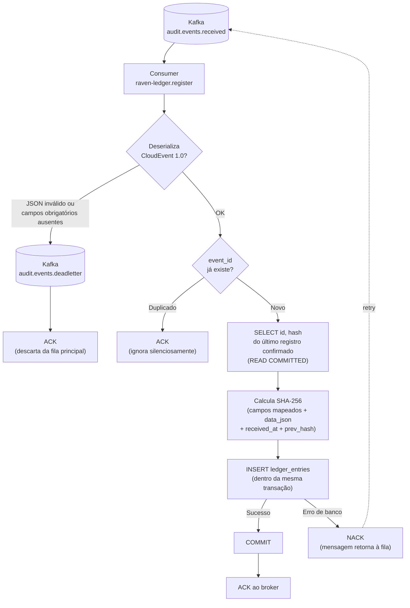
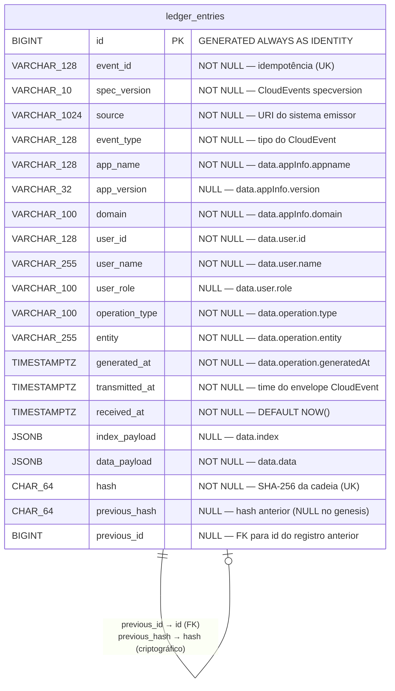
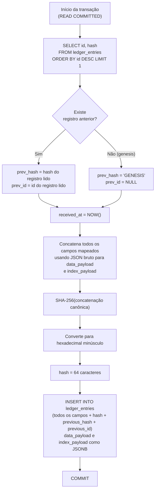
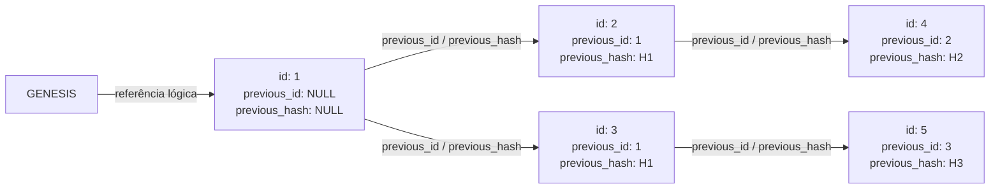

# [FEATURE] FT-03 — Processamento e Persistência Imutável de AuditEvents (Register Service)

## Descrição

**Wave 1 — MVP | Lean Inception: Registro Automático + Registro Imutável**

Esta feature implementa o serviço `raven-ledger.register`, responsável por consumir eventos da fila de mensagens e persistir cada AuditEvent no `LedgerDatabase` de forma imutável. A imutabilidade é a propriedade central de confiabilidade do RavenLedger: uma vez gravado, um registro não pode ser alterado ou removido — nem pelo próprio sistema, nem por administradores de banco de dados (via controle de permissões de role).

Além da imutabilidade por permissão, cada registro mantém uma **cadeia de hashes** que vincula criptograficamente cada entrada à anterior, permitindo detectar qualquer adulteração retroativa mesmo que alguém obtenha acesso direto ao banco.

A separação entre ingestão (FT-02) e persistência (esta feature) é uma decisão arquitetural deliberada: garante o SLA de 100ms na entrada sem comprometer a confiabilidade da gravação.

**Dependências:**
- **FT-01** — `LedgerDatabase` provisionado e acessível (PostgreSQL vazio, sem tabelas).
- **FT-01** — Tópico Kafka `audit.events.received` criado e operacional.
- **FT-02** — Serviço `raven-ledger.ingestion` publicando eventos no tópico.

**Cenários de negócio:**
- **Happy path:** Evento na fila → lido pelo register → payload deserializado → hash calculado → persistido no LedgerDatabase → ACK enviado ao broker.
- **Evento duplicado:** Mesmo `event_id` → registro ignorado silenciosamente (idempotência via UNIQUE constraint).
- **Payload corrompido:** JSON inválido na fila → mensagem movida para dead-letter queue com log de erro.
- **Banco indisponível:** Falha de conexão → NACK, mensagem retorna à fila para reprocessamento.
- **Falha parcial:** Persistência bem-sucedida mas ACK perdido → duplicata bloqueada pela UNIQUE constraint no retry.

## Descrição Técnica

**Serviço:** `raven-ledger.register` (.NET 10, Background Worker — consumer via `Confluent.Kafka`)

**Owner do schema:** Este serviço é o *owner* do `LedgerDatabase`. A FT-01 provisiona o banco vazio; esta feature cria as tabelas via **FluentMigrator** na inicialização do serviço. O número da migration segue o padrão `YYYYMMDDHHmm`.

---

### Bibliotecas Utilizadas

| Biblioteca | Papel neste serviço |
|---|---|
| **Confluent.Kafka** | Client oficial Kafka para consumo do tópico `audit.events.received` e publicação no `audit.events.deadletter`; gestão de ACK/NACK e retry |
| **Dapper** + **Npgsql** | Acesso ao PostgreSQL — SELECT do hash anterior e INSERT em `ledger_entries`; Npgsql como driver ADO.NET |
| **FluentMigrator** | Criação e versionamento do schema do `LedgerDatabase` na inicialização do serviço |
| **Serilog** + **Serilog.Sinks.OpenTelemetry** | Logging estruturado em JSON; emissão via OTLP para o Grafana Alloy |
| **OpenTelemetry .NET SDK** | Instrumentação de métricas e traces; exportação via OTLP para o Grafana Alloy |

**Bibliotecas de teste:** Bogus (geração de dados), NSubstitute (mocks/stubs), AutoBogus.NSubstitute (fakes automáticos), Shouldly (asserções), Coverlet.Collector (cobertura de código).

---

### Configuração e Segredos

A separação entre configuração e segredos segue a política definida nas restrições técnicas do projeto:

| Ambiente | Configuração (não-sensível) | Segredos |
|---|---|---|
| **Desenvolvimento local** | `appsettings.Development.json` | `dotnet user-secrets` — connection string PostgreSQL e endereço/credenciais Kafka |
| **Produção** | Variáveis de ambiente não-sensíveis | **OpenBao** em runtime — connection string, credenciais Kafka e certificados TLS |

O `appsettings.Development.json` **não deve conter nenhum segredo** — apenas overrides de configuração não-sensíveis (ex.: nível de log, nome do tópico).

---

### Fluxo de Processamento

O diagrama abaixo representa o ciclo completo de uma mensagem desde o tópico Kafka até o ACK, incluindo os caminhos de exceção (dead-letter e NACK para reprocessamento).



---

### Modelo de Entidade

A tabela `ledger_entries` não possui relacionamentos com outras tabelas — é uma estrutura self-contained, append-only. O diagrama representa as colunas, tipos e a auto-referência lógica da cadeia de hashes (não é uma FK real; a relação é verificada pela aplicação).



---

### Mapeamento CloudEvent → ledger_entries

O envelope do evento segue a especificação **CloudEvents 1.0** (cf. `docs/systemDesign/event.json`).

| Campo CloudEvent                   | Coluna            | Nulidade | Observação                                                        |
|------------------------------------|-------------------|----------|-------------------------------------------------------------------|
| `id`                               | `event_id`        | NOT NULL | Chave de idempotência                                             |
| `specversion`                      | `spec_version`    | NOT NULL |                                                                   |
| `source`                           | `source`          | NOT NULL | URI do sistema emissor                                            |
| `type`                             | `event_type`      | NOT NULL | Sempre `"AuditEvent"` no MVP                                      |
| `time`                             | `transmitted_at`  | NOT NULL | Campo canônico da spec CloudEvents 1.0                            |
| `data.appInfo.appname`             | `app_name`        | NOT NULL |                                                                   |
| `data.appInfo.version`             | `app_version`     | NULL     |                                                                   |
| `data.appInfo.domain`              | `domain`          | NOT NULL |                                                                   |
| `data.user.id`                     | `user_id`         | NOT NULL |                                                                   |
| `data.user.name`                   | `user_name`       | NOT NULL |                                                                   |
| `data.user.role`                   | `user_role`       | NULL     |                                                                   |
| `data.operation.type`              | `operation_type`  | NOT NULL | insert / update / delete / qualquer string                        |
| `data.operation.entity`            | `entity`          | NOT NULL | Nome da entidade afetada                                          |
| `data.operation.generatedAt`       | `generated_at`    | NOT NULL | Quando a operação ocorreu no sistema cliente                      |
| `data.index`                       | `index_payload`   | NULL     | JSONB com campos customizados de indexação                        |
| `data.data`                        | `data_payload`    | NOT NULL | JSONB com o objeto de negócio auditado                            |
| *(gerado pelo register)*           | `received_at`     | NOT NULL | `DEFAULT NOW()` no INSERT                                         |
| *(calculado antes do INSERT)*      | `hash`            | NOT NULL | Ver algoritmo abaixo                                              |
| *(lido do último registro)*        | `previous_hash`   | NULL     | NULL somente no registro genesis                                  |
| *(lido do último registro)*        | `previous_id`     | NULL     | `id` do registro anterior; NULL somente no registro genesis       |

> **`contenttype`** (campo presente no `event.json`) é um atributo de extensão CloudEvents 0.3, não mapeado para coluna dedicada.
>
> **`data.operation.transmittedAt`** e o campo de envelope `time` carregam o mesmo instante. O mapeamento usa `time` (envelope), pois é o campo canônico da especificação CloudEvents 1.0.

---

### Schema do LedgerDatabase

**Migration:** criada via **FluentMigrator** na inicialização do serviço. O DDL segue as convenções do projeto (`db-conventions`).

#### Constraints

| Constraint | Tipo | Campo(s) |
|---|---|---|
| `pk_ledger_entries` | PRIMARY KEY | `id` |
| `uk_ledger_entries__event_id` | UNIQUE | `event_id` |
| `uk_ledger_entries__hash` | UNIQUE | `hash` |
| `ck_ledger_entries__hash_length` | CHECK | `LENGTH(hash) = 64` |
| `fk_ledger_entries__previous_id` | FOREIGN KEY | `previous_id` → `ledger_entries(id)` |

#### Índices

As constraints `PRIMARY KEY` e `UNIQUE` já criam índices implícitos que cobrem todas as operações do próprio serviço:

| Índice (implícito) | Campo | Operação coberta |
|---|---|---|
| `pk_ledger_entries` | `id` | `SELECT ORDER BY id DESC LIMIT 1` para leitura do hash e id anterior |
| `uk_ledger_entries__event_id` | `event_id` | Checagem de idempotência antes do INSERT |
| `uk_ledger_entries__hash` | `hash` | Garantia de unicidade da cadeia |

| Índice explícito | Campo | Tipo | Motivação |
|---|---|---|---|
| `idx_ledger_entries__previous_id` | `previous_id` | B-tree | Suporte ao JOIN de verificação da cadeia (`ON id = previous_id`) |

Índices adicionais para suportar consultas da interface de visualização serão definidos na feature correspondente, quando os padrões de acesso estiverem especificados.

---

### Algoritmo de Hash

O hash de cada entrada é calculado **antes do INSERT**, na camada de aplicação (C#), com SHA-256 sobre a concatenação canônica de todos os campos mapeados.

#### Por que JSON bruto para `data_payload` e `index_payload`?

O PostgreSQL normaliza JSONB ao armazenar (ordena chaves, remove espaços). Se o hash fosse calculado sobre `data_payload::text` lido de volta do banco, o resultado seria diferente do hash original — tornando a verificação da cadeia impossível sem re-executar o INSERT. A solução é usar o JSON bruto extraído do CloudEvent **antes** da conversão para `JsonDocument`, garantindo byte-fidelidade para o hash enquanto o banco armazena JSONB para queries.

#### Formato canônico

```
hash = SHA-256(
    event_id
    + "|" + spec_version
    + "|" + source
    + "|" + event_type
    + "|" + app_name
    + "|" + (app_version ?? "")
    + "|" + domain
    + "|" + user_id
    + "|" + user_name
    + "|" + (user_role ?? "")
    + "|" + operation_type
    + "|" + entity
    + "|" + generated_at.ToString("yyyy-MM-ddTHH:mm:ss.fffffffZ")
    + "|" + transmitted_at.ToString("yyyy-MM-ddTHH:mm:ss.fffffffZ")
    + "|" + (index_payload_raw_json ?? "")
    + "|" + data_payload_raw_json
    + "|" + received_at.ToString("yyyy-MM-ddTHH:mm:ss.fffffffZ")
    + "|" + (previous_hash ?? "GENESIS")
)
```

O resultado é convertido para hexadecimal minúsculo (64 caracteres) antes de ser armazenado.

- `index_payload_raw_json` — string JSON extraída de `data.index` do CloudEvent original, **antes** de qualquer parse C#. Vazio (`""`) quando o campo estiver ausente.
- `data_payload_raw_json` — string JSON extraída de `data.data` do CloudEvent original, **antes** de qualquer parse C#.
- Campos `NULL` em valores escalares (`app_version`, `user_role`) são representados como string vazia `""` na concatenação.

#### Fluxo dentro da transação



---

### Cadeia de Hash (Hash Chain)

Cada registro aponta para o hash do registro anterior, formando uma cadeia imutável. Qualquer adulteração em um registro invalida todos os hashes posteriores, tornando a fraude imediatamente detectável por uma varredura sequencial.



Sob concorrência, a cadeia pode se bifurcar: dois registros inseridos simultaneamente podem ler o mesmo predecessor confirmado e ambos referenciar seu `id` e `hash`. O resultado é uma **árvore enraizada no genesis**, não necessariamente uma lista linear. Isso é esperado e não indica adulteração — bifurcações são detectáveis pela própria estrutura do grafo (dois registros com o mesmo `previous_id`).

A cadeia possui dois mecanismos complementares de integridade:

| Mecanismo | Campo | Propósito |
|---|---|---|
| **Estrutural** | `previous_id` (FK) | Navegação relacional — permite percorrer a árvore via JOIN e detecta registros sem predecessor válido |
| **Criptográfico** | `previous_hash` (SHA-256) | Detecta adulteração retroativa — qualquer alteração em campos de um registro invalida todos os hashes no(s) ramo(s) descendente(s) |

**Verificação da cadeia:** percorre todos os caminhos do genesis até as folhas (registros sem descendentes). Em cada caminho, recalcula o hash de cada registro — extraindo os campos escalares e os JSON de `data_payload::text` / `index_payload::text` — e valida que `previous_hash` do registro atual corresponde ao `hash` do registro apontado por `previous_id`. Se qualquer registro foi adulterado, removido ou inserido com referência inválida, ao menos um dos mecanismos quebrará naquele ramo.

> **Atenção:** durante a verificação, os campos JSONB devem ser lidos como `::text` e re-normalizados da mesma forma que foram gerados originalmente (usando o JSON bruto). A aplicação de verificação precisa ter acesso ao JSON bruto original ou reproduzir a normalização JSONB do PostgreSQL para recalcular o hash corretamente.

---

### Serialização da Cadeia

Para manter a integridade criptográfica, a única garantia necessária é que o registro lido como predecessor já esteja **confirmado** no banco no momento da leitura — o que o isolamento padrão **READ COMMITTED** do PostgreSQL assegura. Não há lock adicional.

Sob concorrência, múltiplas threads ou instâncias podem ler o mesmo predecessor e inserir registros em paralelo, bifurcando a cadeia. Isso é um comportamento esperado e não compromete a verificabilidade (ver seção Cadeia de Hash).

A sequência dentro da transação é: **ler `id` e `hash` do último registro confirmado → calcular o novo hash na aplicação → executar o INSERT (incluindo `previous_id` e `previous_hash`) → COMMIT**.

---

### Permissões e Controle de Acesso

O controle de acesso é o primeiro nível de garantia de imutabilidade.

| Role           | SELECT | INSERT | UPDATE | DELETE | TRUNCATE | Sequence     |
|----------------|:------:|:------:|:------:|:------:|:--------:|:------------:|
| `register_app` | ✅     | ✅     | ❌     | ❌     | ❌       | USAGE        |
| `ledger_dba`   | ✅     | ✅     | ✅     | ✅     | ❌       | USAGE+SELECT |

- **`register_app`** — usuário de aplicação do `raven-ledger.register`. `UPDATE` e `DELETE` revogados explicitamente.
- **`ledger_dba`** — role de administração. `UPDATE` e `DELETE` existem para operações de manutenção autorizadas e jamais são exercidos pelo fluxo normal da aplicação.

---

### Dead-letter Queue

Tópico Kafka: `audit.events.deadletter`

| Condição                                                    | Destino      |
|-------------------------------------------------------------|--------------|
| JSON inválido / não deserializável como CloudEvent 1.0      | Dead-letter  |
| Campos obrigatórios ausentes (`event_id`, `source`, `type`) | Dead-letter  |
| Campo `data.data` ausente ou não serializável como JSON     | Dead-letter  |
| Falha de conexão com o banco                                | NACK → retry |
| Timeout de banco                                            | NACK → retry |
| Erro transitório de infraestrutura                          | NACK → retry |

---

### Observabilidade

#### Logs Estruturados

O serviço emite logs estruturados via **Serilog**, configurado com `Serilog.Sinks.OpenTelemetry` para exportação via OTLP. Pipeline de ingestão:

**Serilog (serviço)** → **Grafana Alloy (OTLP)** → **Loki** → **Grafana**

| Evento                      | Campos                                                                    |
|-----------------------------|---------------------------------------------------------------------------|
| `event_persisted`           | `event_id`, `entity`, `domain`, `operation_type`, `processing_time_ms`  |
| `event_duplicate_ignored`   | `event_id`                                                                |
| `event_processing_failed`   | `event_id`, `error`, `retry_count`                                        |
| `event_dead_lettered`       | `event_id`, `reason`                                                      |

#### Métricas e Traces

Métricas e traces são instrumentados via **OpenTelemetry .NET SDK** e exportados via OTLP para o Grafana Alloy:

| Sinal | Pipeline |
|---|---|
| **Métricas** | OpenTelemetry SDK → Grafana Alloy (OTLP) → Prometheus → Grafana |
| **Traces** | OpenTelemetry SDK → Grafana Alloy (OTLP) → Tempo → Grafana |

---

### Testes de Carga (k6)

O script k6 é versionado no repositório junto ao serviço `raven-ledger.register`, conforme as restrições técnicas do projeto.

**SLOs a validar:**

| Indicador | SLO |
|---|---|
| Taxa de processamento bem-sucedido | > 99,9% |
| Lag da fila em operação normal | < 1.000 mensagens |
| Tempo de processamento P99 | < 500ms |

**Cenário mínimo:**
- Publicar mensagens no tópico `audit.events.received` em volume e cadência representativos da operação normal
- Medir o tempo entre publicação e confirmação de persistência (via polling em `ledger_entries` ou marcador de log estruturado)
- Verificar que > 99,9% das mensagens são persistidas com sucesso dentro do SLO de P99

**Exportação de métricas:** k6 exporta para **Prometheus**; visualização e alertas via **Grafana**, consistente com a stack de observabilidade do projeto.

---

### Análise Estática

| Ferramenta | Momento de execução | Comportamento em violação |
|---|---|---|
| **StyleCop** | Build-time via Roslyn | Build quebra — nenhuma violação silenciosa |
| **Roslynator** | Build-time via Roslyn | Build quebra |
| **SonarQube** | CI — quality gate da PR | PR bloqueada se quality gate falhar |

Supressões (`#pragma warning disable`, `[SuppressMessage]`) são proibidas sem justificativa documentada no mesmo arquivo.

---

## Critérios de Aceite

- [ ] Migration de criação da tabela `ledger_entries` executa ao inicializar o serviço e cria a tabela com todos os campos, constraints, índices, permissões e comentários definidos
- [ ] Evento publicado na fila é consumido e persistido no LedgerDatabase
- [ ] Todos os campos do mapeamento CloudEvent → `ledger_entries` estão corretamente populados (incluindo `spec_version`, `app_version`, `user_role`, `index_payload`)
- [ ] `data_payload` contém o objeto de negócio de `data.data` armazenado como JSONB
- [ ] `hash` é calculado corretamente segundo o algoritmo canônico definido, usando o JSON bruto de `data_payload` e `index_payload`
- [ ] `previous_hash` aponta para o `hash` do registro com `id` imediatamente anterior; primeiro registro tem `previous_hash = NULL`
- [ ] Evento com `event_id` já existente é ignorado sem erro (idempotência via `uk_ledger_entries__event_id`)
- [ ] Usuário de aplicação `register_app` não consegue executar UPDATE ou DELETE em `ledger_entries`
- [ ] Payload corrompido (JSON inválido, campos obrigatórios ausentes ou `data.data` inválido) vai para `audit.events.deadletter` sem travar o consumer
- [ ] Falha de banco resulta em NACK e reprocessamento (sem perda de mensagem)
- [ ] Log `event_persisted` emitido com campos corretos para cada gravação
- [ ] Serviço retoma processamento automaticamente após reconexão com broker ou banco
- [ ] Varredura da árvore de hashes não encontra inconsistências após 1.000 inserções concorrentes — cada registro possui `previous_hash` igual ao `hash` do registro apontado por `previous_id`
- [ ] Build passa sem violações de **StyleCop** ou **Roslynator** (build quebra em qualquer violação)
- [ ] **SonarQube** quality gate passa na PR — cobertura acima do threshold definido, sem novas vulnerabilidades ou code smells bloqueantes
- [ ] Script k6 valida P99 < 500ms no cenário de carga nominal; métricas exportadas e visíveis no Prometheus/Grafana

## Cenários de Teste

```gherkin
# language: pt

@regression
Feature: Processamento e persistência imutável de AuditEvents
  Como serviço de registro do RavenLedger
  Quero consumir eventos da fila e persistir cada um de forma imutável
  Para garantir que o histórico de auditoria seja confiável e não possa ser adulterado

  Background:
    Given que o broker Kafka está operacional com o tópico audit.events.received
    And que o LedgerDatabase está acessível
    And que a migration de criação do ledger_entries foi executada

  # AC-1 e AC-2: Evento da fila persistido com mapeamento correto
  @happy-path @ac-1 @ac-2
  Scenario: AuditEvent publicado na fila é persistido com todos os campos mapeados
    Given que um AuditEvent válido foi publicado na fila audit.events.received
    When o serviço de registro consome a mensagem
    Then um registro é criado no LedgerDatabase com todos os campos do mapeamento CloudEvent corretamente populados
    And o campo data_payload contém o objeto de negócio de data.data como JSONB
    And o campo spec_version está preenchido com o valor do envelope CloudEvent
    And o campo index_payload contém os campos customizados enviados em data.index

  # AC-6: Hash calculado corretamente
  @happy-path @ac-6
  Scenario: Hash do registro é calculado a partir da concatenação canônica de todos os campos
    Given que um AuditEvent válido foi publicado na fila
    When o serviço de registro consome e persiste a mensagem
    Then o campo hash do registro é o SHA-256 da concatenação canônica de todos os campos mapeados
    And o cálculo usou o JSON bruto de data_payload e index_payload antes da conversão para JSONB

  # AC-6: Cadeia de hash íntegra após múltiplas inserções concorrentes
  @happy-path @ac-6
  Scenario: Cadeia de hash permanece íntegra após inserções concorrentes
    Given que 10 AuditEvents foram publicados e persistidos de forma concorrente
    When a árvore de hashes é verificada percorrendo todos os caminhos do genesis até as folhas
    Then o previous_hash de cada registro corresponde ao hash do registro apontado por previous_id
    And o registro genesis possui previous_hash nulo e previous_id nulo
    And bifurcações na cadeia são detectadas e não indicam adulteração

  # AC-4: Idempotência por event_id
  @happy-path @ac-4
  Scenario: Evento com identificador duplicado é ignorado sem causar erro
    Given que um evento com o identificador "evt-duplicado" já foi persistido no LedgerDatabase
    When o mesmo evento é publicado novamente na fila
    Then apenas um registro com esse identificador existe no LedgerDatabase
    And nenhum erro é registrado no log
    And o log event_duplicate_ignored é emitido com o event_id correspondente

  # AC-5: Imutabilidade — UPDATE bloqueado
  @exception @ac-5 @regression
  Scenario: Tentativa de atualizar registro existente é rejeitada pelo banco
    Given que um registro existe no LedgerDatabase
    When o usuário de aplicação register_app tenta executar uma atualização nesse registro
    Then a operação é negada pelo banco de dados com erro de permissão

  # AC-5: Imutabilidade — DELETE bloqueado
  @exception @ac-5 @regression
  Scenario: Tentativa de remover registro existente é rejeitada pelo banco
    Given que um registro existe no LedgerDatabase
    When o usuário de aplicação register_app tenta remover esse registro
    Then a operação é negada pelo banco de dados com erro de permissão

  # AC-7: Payload corrompido vai para dead-letter
  @exception @ac-7
  Scenario: Mensagem com JSON inválido é movida para dead-letter sem travar o consumer
    Given que uma mensagem com conteúdo corrompido foi publicada na fila audit.events.received
    When o serviço de registro tenta processar a mensagem
    Then a mensagem é movida para a fila audit.events.deadletter
    And o log event_dead_lettered é emitido com o motivo da rejeição
    And o consumer continua processando as demais mensagens normalmente

  # AC-7: data.data ausente vai para dead-letter
  @exception @ac-7
  Scenario: Mensagem sem o campo data.data é movida para dead-letter
    Given que uma mensagem sem o campo data.data foi publicada na fila audit.events.received
    When o serviço de registro tenta processar a mensagem
    Then a mensagem é movida para a fila audit.events.deadletter
    And o consumer continua processando as demais mensagens normalmente

  # AC-7: Payload com campos obrigatórios ausentes vai para dead-letter
  @exception @ac-7
  Scenario: Mensagem sem campo obrigatório é movida para dead-letter
    Given que uma mensagem sem o campo event_id foi publicada na fila audit.events.received
    When o serviço de registro tenta processar a mensagem
    Then a mensagem é movida para a fila audit.events.deadletter
    And o consumer continua processando as demais mensagens normalmente

  # AC-8: Falha de banco resulta em reprocessamento sem perda de mensagem
  @exception @ac-8
  Scenario: Falha temporária de conexão com o banco não causa perda de mensagem
    Given que um evento válido está na fila para processamento
    When o LedgerDatabase fica temporariamente indisponível durante o processamento
    Then o evento retorna à fila sem ser descartado
    And após a reconexão com o banco o evento é processado com sucesso

  # AC-9: Log de persistência
  @happy-path @ac-9
  Scenario: Log estruturado emitido para cada evento persistido contém os campos esperados
    Given que um AuditEvent válido foi consumido da fila
    When o registro é criado no LedgerDatabase
    Then o log event_persisted é emitido com event_id, entity, domain, operation_type e processing_time_ms
```

## Priority

1

## Risk

1 — Alto. O schema do `ledger_entries` é a estrutura de dados permanente do produto. Em tabela append-only com dados reais, qualquer migration que altere colunas existentes é uma operação de alto risco. Decisões de schema devem ser bem validadas antes do primeiro deploy com dados reais. A cadeia de hashes amplifica esse risco: uma mudança no algoritmo de hash ou nos campos incluídos no cálculo invalida toda a cadeia histórica.

O uso de `data_payload` como JSONB exige atenção especial na verificação da cadeia: a aplicação de auditoria precisa reproduzir o JSON bruto original (não o JSONB normalizado) para recalcular os hashes históricos.

## Effort

3 — M. A lógica de consumer Kafka com retry e dead-letter é bem documentada para Confluent.Kafka. O ponto de atenção é o advisory lock para serialização da cadeia de hashes — requer teste de concorrência cuidadoso mesmo no MVP. A gestão do JSON bruto para cálculo de hash (antes do parse para JSONB) requer cuidado na implementação do serviço.
