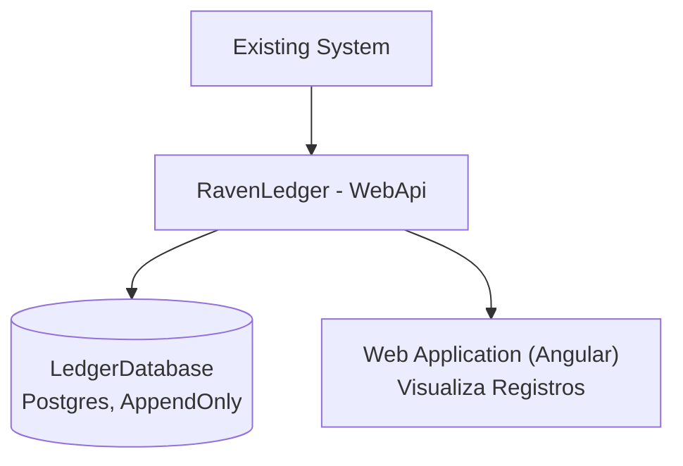
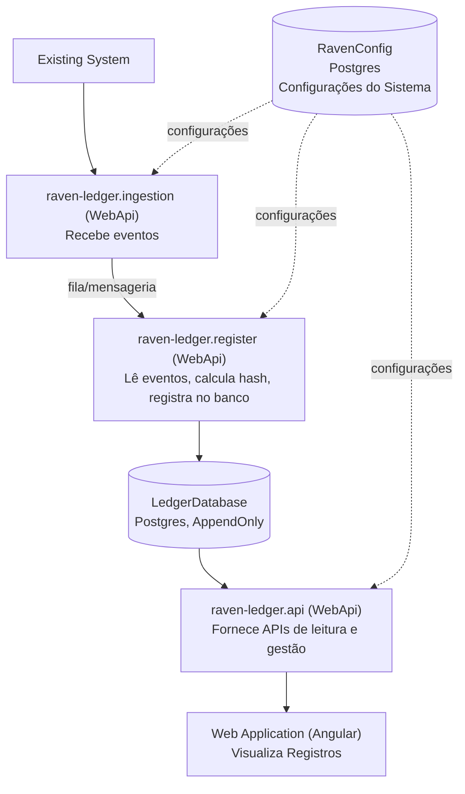

# System Design — RavenLedger

## Requisitos Não-Funcionais

- Todas as APIs respondendo em menos de 200ms
- APIs de recepção de eventos: < 100ms
- Processamento de hash/assinatura deve ocorrer **após** a persistência (para não violar o SLA de 100ms)

---

## Volumetria

### Transacional (sistemas clientes)

Imprevisível — varia muito por contexto:

| Contexto              | Volume estimado                        |
|-----------------------|----------------------------------------|
| Sistemas Bancários    | > Milhões de registros/dia             |
| IoT (por planta)      | Milhões de registros/dia               |
| Processos industriais | De poucos a milhares de registros/dia  |
| Referência de cálculo | 1M/mês → 33.333/dia → 23,1/minuto      |

### Auditoria (~5x maior que transacional)

A volumetria de auditoria é sempre maior que a transacional:

| Caso        | Proporção Transacional → Auditoria                  |
|-------------|------------------------------------------------------|
| Raro        | 1 → 1 (apenas Insert)                               |
| Melhor      | 1 → 4 (Insert + 3x Update)                          |
| Médio       | 1 → 5 (Insert + 3x Update + Delete)                 |
| Pior        | 1 → N+1 (Insert + N operações sobre o registro)     |

---

## Sistemas Clientes (Existing Systems)

Exemplos de sistemas que enviariam eventos ao RavenLedger:

- CRM
- Financeiro
- Portfólio
- Venda
- Fiscal
- Estoque
- Notificação

---

## Arquiteturas Propostas

### Opção 1 — Versão Síncrona

**Prós:**
- API simples, foco em registrar eventos direto no banco
- Frontend pode ser substituído por pesquisa direta no banco (foco MVP)
- Escala vertical: mais instâncias de API podem subir para aguentar a vazão

**Contras:**
- Escala vertical limitada pelo banco de dados
- Picos podem tornar lento o processo de gravação
- Há possibilidade de perda de dados ou impacto de performance na Existing System

---

### Opção 2 — Versão "Básica" (Assíncrona)

**Prós:**
- Confiável: não perde mensagens de auditoria
- Estável: redundância permite resiliência a falhas
- Escalável: o único gargalo passa a ser o banco, sem afetar as pontas
- Flexível: permite evolução da arquitetura majoritariamente com configuração

**Contras:**
- Complexidade: muitos serviços para construir e manter
- Debug pode ser um desafio
- Requer ferramenta de observabilidade

---

## Stack

- .Net 10 para implementação de serviços;
  - Swashbuckle.AspNetCore para geração de OpenApi;
  - Serilog para geração de Logs estruturados (JSON);
  - Confluent.Kafka para conexão ao Kafka;
  - Dapper como ORM;
  - Npgsql como driver de acesso ao banco postgres;
  - FluentMigrator para gestão de migrations;
  - Bogus para geração de dados aleatórios para teste;
  - NSubstitute e Autobogus.NSusbstitute para mocks e stubs;
  - Coverlet.Collector para coleta de cobertura de código;
  - Shouldly para asserções com melhor legibilidade;
  - StyleCop, Roslynator e 
- Angular (LTS) para frontend
- Kafka como messager broker;
- Postgres como banco de dados;
- K3D como gerenciador de containeres;
- ArgoCD para Continuous Deployment;
- GitHub Actions para pipelines;
- OpenBao para armazenamento de secrets;

### Migrations e manutenção dos bancos

Os bancos serão mantidos pelo sistema "owner" deles. Nesse caso o owner do banco `LedgerDatabase Postgres, AppendOnly` é a aplicação `raven-ledger.register`. Já o banco `RavenConfig Postgres Configurações do Sistema` é mantido pela api `raven-ledger.api`.

---

## Autenticação

As aplicações devem utilizar **KeyCloak** para criação de um token de serviço que garanta a autenticidade de quem está enviando o evento para o Ledger.

---

## Gestão de Segredos

Nenhum segredo deve ser versionado — nem mesmo os que configuram ambiente local.

- **Ambientes produtivos**: os segredos devem ser armazenados no **OpenBao**, com a aplicação acessando diretamente o vault e baixando os segredos.
- **Ambiente local**: os segredos devem ser armazenados em arquivos `.env` que **jamais** serão versionados. Para cada `.env` esperado, no mesmo nível do repositório haverá um `.env.template`, apenas com os nomes das secrets e sem valor real atribuído.

---

## Questões em Aberto

### Vale a pena ser multi-tenant?

A volumetria pode ser um impeditivo para manter várias empresas em uma mesma infra. Ter todos os dados em um mesmo pacote pode abrir brechas de segurança. Como modelo de negócio, pode ser caro manter várias estruturas diferentes. Precificação por volume de dados? Focar em clientes pequenos para o MVP?

### Vale a pena ser OpenSource/OnPremisse?

OpenSource pode aumentar a confiabilidade no produto, uma vez que o próprio código pode ser auditado por órgãos externos — inclusive pelos peritos.

### Postgres é realmente a melhor escolha?

A intenção é desenvolver o MVP da forma mais rápida e simples possível. Acredito que bancos relacionais **ainda** são a solução mais simples e comum entre as novas pessoas da área. Então quero seguir com Postgres.

No entanto, sua adoção pode trazer dificuldades em processos como:
- Sharding (por tenant, tempo etc.)
- Full Text Searching
- Pesquisas de dados em campos alterados

O que vai nos "forçar" a fazer algumas coisas na mão.

### Over Engineering?

Parece — no início temos apenas "zero" usuários, o que diminui bastante a pressão inicial sobre os componentes.

Porém, a primeira e principal restrição técnica é a de que as APIs retornem em 100ms ou menos, exigindo de antemão que todo o processo de assinatura de dados seja posterior à persistência dele. Essa abordagem abriria um espaço de tempo que permitiria a alteração dos dados antes da assinatura, quebrando a confiança em sua cadeia de manutenção. Do contrário, os dados teriam de ser assinados durante o request, potencialmente quebrando a restrição de <100ms.

Outro argumento está no compartilhamento de processamento: bastaria que uma requisição se tornasse mais "fominha" de recursos para, então, afetar o tempo de resposta do endpoint de recepção de eventos, mais uma vez quebrando a restrição dos <100ms.

Outros argumentos como ponto único de falha, escala vertical e interação com banco de dados também são válidos.

Por fim, pensando em escala, não seria possível transicionar de uma estrutura para outra de maneira satisfatoriamente rápida, potencialmente ofendendo indicadores dos usuários e quebrando confiança na plataforma.
